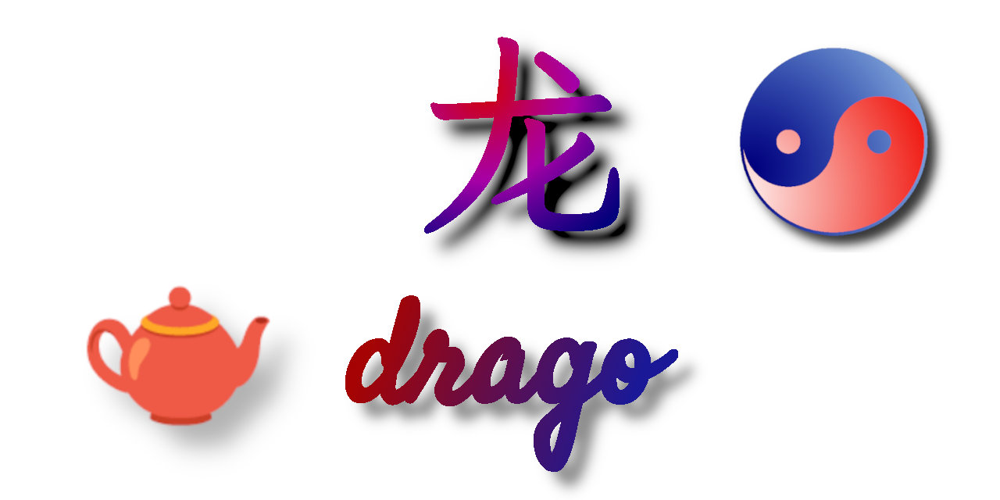

# drago

_Random sinogram generator for TypeScript_


[](https://badge.fury.io/js/@giancosta86%2Fdrago)
[](/LICENSE)



**drago** is a _web assembly_ for **TypeScript**, written in **Rust**, at the top of a technological stack which includes [chinese-format](https://crates.io/crates/chinese-format), [chinese-rand](https://crates.io/crates/chinese-rand) and other crates; the name of this project stems from the Italian word describing one of the fabled, 🌺sublime 🫖dragons of the Eastern legends.

Its purpose is simple and elegant: _generating random Chinese logograms_ via the `LogogramGenerator` class - in accordance with the parameters provided by the user as a variety of thematic categories.

## Installation

### TypeScript

The package on NPM is:

> @giancosta86/drago

The public API entirely resides in the root package index, so you shouldn't reference specific modules.

# Usage

The purpose of this library is to _create random Chinese logograms on demand_ - which can be achieved via a sequence of minimalist steps:

1. Import the required concepts:

   ```typescript
   import initDrago, {
     LogogramGenerator,
     RandomParams,
   } from "@giancosta86/drago";
   ```

1. Initialize the web assembly; in any initialization block of your client, call:

   ```typescript
   await initDrago(/*[optional module/path/URL here]*/);
   ```

   - **Note 1**: for _synchronous_ initialization, the `initSync` function is available as a named import.

   - **Note 2**: in a variety of contexts, you might want to pass a parameter related to the location or the data of your **.wasm** file.

1. Create the `LogogramGenerator` - by calling its `create` static method and passing an object complying with the `RandomParams` interface. For example:

   ```typescript
   const logogramGenerator = LogogramGenerator.create({
     seed: 90,
     variant: "Simplified",
     fraction: {
       denominatorRange: [1, 7],
       numeratorRange: [4, 21],
     },
     decimal: {
       integerRange: [1, 42],
       fractionalLengthRange: [1, 3],
     },
     deltaTime: true,
   });
   ```

   Later, you can store the instance and use it wherever you need.

   **Note 1**: most of the fields are optional - but _at least one_ of the optional fields must be present, or the `deltaTime` field must be set to `true`; this constraint is due to the fact that the `LogogramGenerator` requires at least one generation strategy.

   **Note 2**: anyway, in case of unacceptable settings, the `create` method will throw an object of type `RandomParamsError`, containing a detailed (and type-based) description.

   **Note 3**: because of limitations in the underlying implementation, you cannot have two or more independent `LogogramGenerator` instances: creating each instance automatically resets - to the latest value - the seed of the internal randomization engine, from which every single instance would draw its random data.

   **In summary**: you should have just **one** instance of `LogogramGenerator` in your client.

1. Call `logograms()` whenever you need to create random logograms: the generator will randomly pick one of the provided strategies, returning the Chinese characters as a `string`:

   ```typescript
   let characters: string = logogramGenerator.characters();
   ```

   **Note**: the generation of characters is a _safe_ operations - because all the validations occur when instantiating `LogogramGenerator`.

## See also

- [chinese-format](https://crates.io/crates/chinese-format)

- [chinese-rand](https://crates.io/crates/chinese-rand)

- [digit-sequence](https://crates.io/crates/digit-sequence)

- [dyn-error](https://crates.io/crates/dyn-error)
